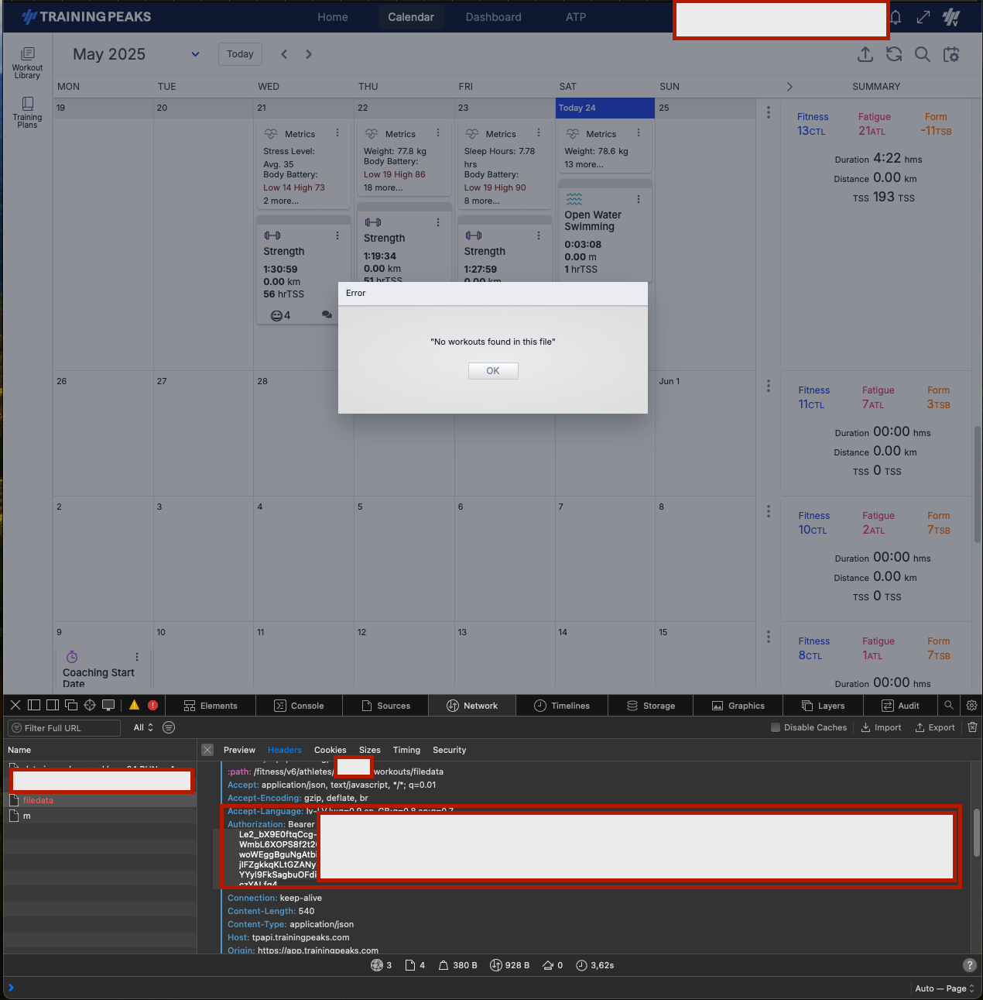

# FIT TO TrainingPeaks

Tiny rust program to streamline FIT file uploading to TrainingPeaks.

# Usage
1. Request data export from garmin using https://www.garmin.com/en-US/account/datamanagement/exportdata/
2. Unzip the downloaded file.
3. Under `DI_CONNECT/DI-Connect-Uploaded-Files`, extract ALL uploads, those are the sources for the FIT files.
4. Open the web browser, navigate to calendar, open developer tools, try to drag and drop the FIT any fit into the calendar.
5. Copy `Authnetication: Bearer` header value from the request and athelete_id from the request URL 
6. Run the uploader
```
fit2tp --fit-file-dir-path ./UploadedFiles_0-_Part1 --auth-bearer-token='TOKEN' --athlete-id=ATHLETE_ID
```